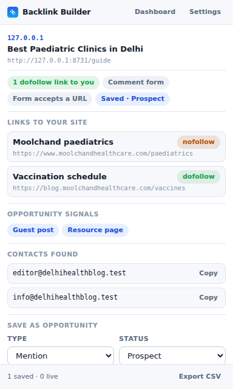

# Backlink Builder

A Chrome extension (Manifest V3) for finding, qualifying, and tracking backlink opportunities
while you browse. No build step, no accounts, no servers — everything runs locally.



## What it does

**Reads the page you're on** and tells you the things that decide whether a link is worth chasing:

- whether the page **already links to your domain**, and whether that link is `dofollow`,
  `nofollow`, `ugc`, or `sponsored` — a nofollow link looks identical in a browser but passes no
  ranking signal
- whether the page is `noindex`, which makes any link on it worthless
- **contact addresses** on the page, with role addresses (`editor@`, `info@`) sorted first
- **opportunity signals** — "write for us", "submit your site", "useful resources",
  "advertise with us" — and whether there's a comment form or a form that accepts your URL
- internal vs external link counts and word count, as a rough quality read

**Tracks each prospect** through `prospect → contacted → replied → submitted → live / rejected`,
with anchor text, target URL, contact, and notes.

**Verifies links are still live.** The dashboard re-fetches every saved page, looks for your link,
re-reads its `rel`, and flips the row to *live* or *rejected*. Links get removed or quietly changed
to nofollow all the time; this is how you find out.

**Drafts outreach.** A templated email with `{{pageTitle}}`, `{{domain}}`, `{{anchor}}`,
`{{targetUrl}}` and friends, copied to your clipboard or opened in your mail client.

## Install

1. Open `chrome://extensions`
2. Turn on **Developer mode** (top right)
3. **Load unpacked** → select this `extension/` folder
4. The options page opens on first install — add the domain you're building links to

Works in any Chromium browser with MV3 support: Chrome, Edge, Brave, Opera, Arc.

## Using it

**The toolbar badge** summarises each page as you browse:

| Badge | Meaning |
| --- | --- |
| green number | that many links to your domain, at least one dofollow |
| amber number | links to you exist, but all are nofollow/ugc/sponsored |
| blue `•` | you've already saved this page as an opportunity |
| violet `?` | no link yet, but the page shows opportunity signals |
| nothing | nothing of interest here |

Turn the badge off in settings if you'd rather the extension only look when you open the popup.

**The popup** shows the analysis and saves the page as an opportunity. Re-saving the same URL
updates the existing record instead of creating a duplicate.

**Right-click** any page or link → *Save as a backlink opportunity*. Selected text becomes the note.

**The dashboard** (button in the popup) is the working list: search, filter by status and type, edit
status and type inline, verify links, and export.

- **Verify** — with rows selected it checks those; with none selected it checks everything shown
- **CSV** — exports the currently filtered view, for a client report or a spreadsheet
- **Backup / Restore** — full JSON of settings and opportunities; restore merges by URL, so
  re-importing a backup won't duplicate rows

## Data and privacy

Everything is in `chrome.storage.local` on your machine. The extension has no server, sends no
analytics, and has no accounts. The only network requests it ever makes are the page fetches you
trigger with the **Verify** button, made straight to the sites you saved.

Nothing here posts, submits, or comments anywhere on your behalf — it reads pages and keeps your
notes. Submitting anything is still your call, on the site's own terms.

## Permissions

| Permission | Why |
| --- | --- |
| `storage` | saving your opportunities and settings locally |
| `activeTab`, `scripting` | analysing the page when you open the popup, including tabs that were already open before you installed the extension |
| `tabs` | reading the current tab's URL and title, and setting a per-tab badge |
| `contextMenus` | the right-click "save as opportunity" items |
| `host_permissions` (`http`/`https`) | running the page analyser, and fetching saved pages when you click Verify |

## Layout

```
manifest.json      MV3 manifest
background.js      service worker: context menus, badge, link verification
content.js         page analyser (passive — only runs when asked)
popup.html/.js     the toolbar popup
dashboard.html/.js the opportunity list
options.html/.js   settings
lib/store.js       storage, templating, CSV — shared by every page
css/               base tokens (light + dark) and per-page styles
test/              unit and end-to-end tests
```

## Tests

```bash
node test/unit.test.mjs   # manifest, asset refs, storage, link parsing, signal regexes
node test/e2e.test.mjs    # loads the extension in real Chromium and drives the whole flow
```

The end-to-end suite starts a local site, loads the unpacked extension, and asserts the analysis,
badge, popup, dashboard, verification fetch, and options page all behave. It needs Playwright and a
full Chromium build — the headless shell can't load extensions. Set `CHROMIUM_PATH` if it can't
find one.

## Packaging

```bash
cd extension && zip -r ../backlink-builder.zip . -x 'test/*' 'README.md' 'docs/*'
```

## Known limits

- Verification fetches the page as your browser would but without your cookies, so sites behind
  Cloudflare or a login may answer 403. Those rows report "unreachable" rather than silently
  marking your link dead.
- The analyser reads the rendered DOM, so it sees JavaScript-injected links — but only the top
  frame, not links inside iframes.
- There are no third-party authority metrics (DA/DR). Those need a paid API; this extension
  deliberately talks to nothing but the sites you point it at.
